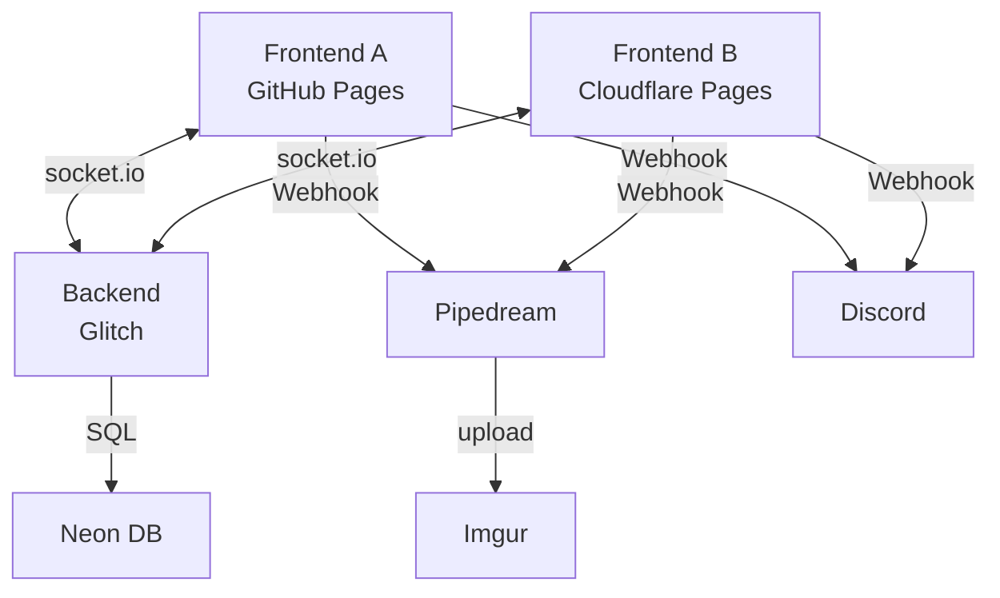

```mermaid
flowchart TD
    %% Frontend群
    A[Frontend A<br>GitHub Pages]
    B[Frontend B<br>Cloudflare Pages]

    %% バックエンド
    C[Backend<br>Glitch]

    %% その他のサービス
    D[Neon DB]
    E[Pipedream]
    F[Discord]
    G[Imgur]

    %% FrontendとBackendのsocket.io通信（双方向）
    A <--> |"socket.io"| C
    B <--> |"socket.io"| C

    %% バックエンドとNeon DB
    C --> |"SQL"| D

    %% FrontendとPipedream
    A --> |"Webhook"| E
    B --> |"Webhook"| E
    A --> |"Webhook"| F
    B --> |"Webhook"| F
    E --> |"upload"| G
```